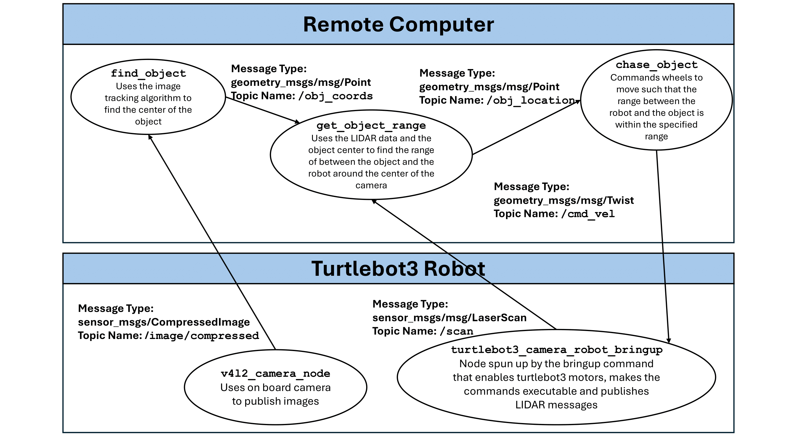

# IRR Lab 3
This ROS2 package is a custom navigation program for turtlebot3 in ROS2. 

1. `ros2 launch turtlebot3_bringup camera_robot.launch.py` Launch turtlebot stack (includes camera)
2. `ros2 run cost_map cost_map_pubsub` Run mapping node which subscribes to /scan and publishes the costmap to /map
3. `ros2 run localization localization_pubsub` Run localization node which subscribes to /odom and /imu and publishes EKF fused localization to /odometry/filtered
4. `ros2 run path_plan path_plan_pubsub` Run path planning node which subscribes to /map and /odometry/filtered and publishes the desired path to /path
5. `ros2 run control control_pubsub` Run control node which subscribes to /path and publishes velocity commands to /cmd_vel

## ROS Diagram

