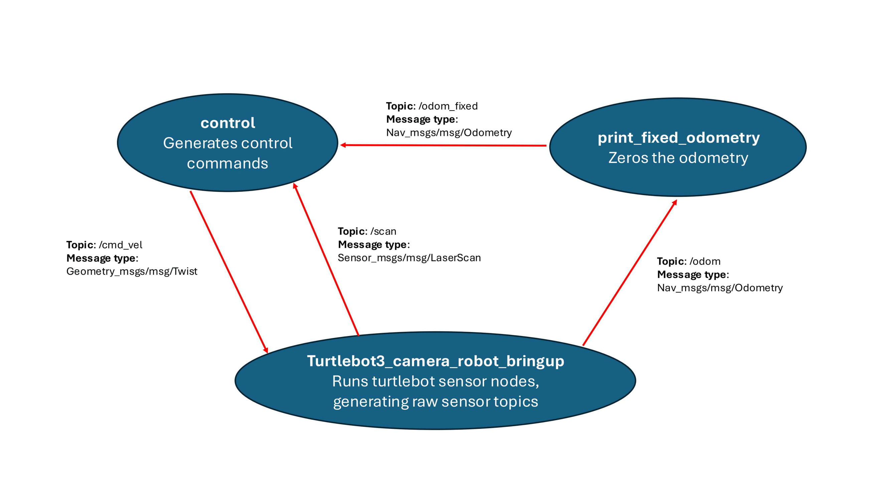

# IRR Lab 4
This ROS2 package is a custom navigation program using the bug algorithm for turtlebot3 in ROS2. 

## How it Works
The control node has 5 tasks and 4 states in a state machine:
#### Tasks:
1. Go to wayPoint 1
2. Rotate towards to wayPoint 2
3. Go to wayPoint 2
4. Rotate towards to wayPoint 2
5. Go to wayPoint 3
#### States (controllers):
1. Go to goal - constant position and orientation error correction until within threshold of goal
2. Back up - if an object appears and is far too close, reverse until out of this predicament
3. Follow wall - rotate to face parallel with wall as you go towards the obstacle; the combination of rotations causes wall following while going towards the goal
4. Rotate in place - for tasks 2 and 4 where rotation is all that is required. We could incorporate this into state 1, but the go to goal only matters for position, not orientation right now

## How to Run
1. `ros2 launch turtlebot3_bringup camera_robot.launch.py` Launch turtlebot stack (includes camera)
2. `ros2 run print_fixed_odometry zero_odom` Run odom zeroing node which subscribes to /odom and publishes the zero'd odom to /odom_fixed
3. `ros2 run control get_control` Run control node which subscribes to /odom_fixed and /scan and publishes velocity commands to /cmd_vel

## ROS Diagram

